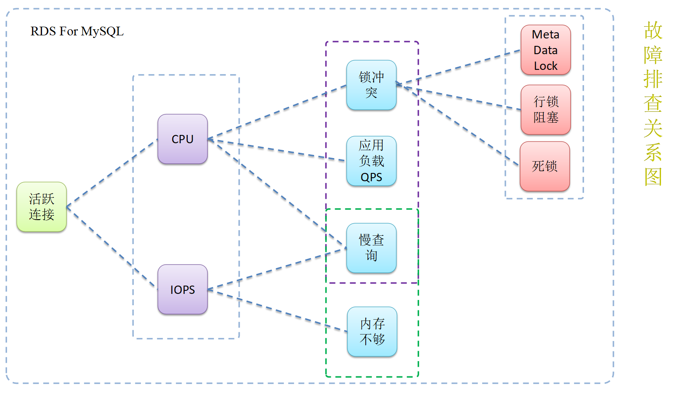

# 在实践中成长 愿与你同行

> 本项目重点在于对**数据库技术实战经验记录总结**

## 技术分类

| 数据库技术             | 技术分类       | 详细                                       | 案例                                       |
| ----------------- | ---------- | ---------------------------------------- | ---------------------------------------- |
| 自建MySQL           | 安装部署       | 高可用搭建                                    | [MySQL主从+Consul实现自动故障转移和主从自动恢复](02-redis-consul) |
|                   |            | 主从同步搭建                                   |                                          |
|                   |            | 从系统盘迁移至数据盘                               |                                          |
|                   | 架构迁移       | 自建到自建迁移                                  |                                          |
|                   | 故障排查       | 主从同步断开                                   |                                          |
|                   |            | 主从同步延迟变大                                 |                                          |
|                   |            | 主从同步MetaDataLock                         |                                          |
|                   |            | 内存使用率高                                   |                                          |
|                   |            | 在线破解root密码                               |                                          |
|                   |            | 连接故障                                     |                                          |
|                   |            | 人为误操作回滚                                  |                                          |
|                   | 数据库优化      | mysql优化                                  |                                          |
|                   | 技术支持       | 高可用架构设计                                  |                                          |
|                   |            | 备份计划设计                                   |                                          |
| 自建Redis           | 安装部署       | redis高可用搭建                               | [Redis主从+Consul实现自动故障转移和主从自动恢复](02-redis-consul) |
|                   | 架构迁移       |                                          |                                          |
|                   | 故障排查       |                                          |                                          |
|                   | 数据库优化      | redis一主两从                                |                                          |
| RDS For MySQL     | 安装部署       | RDS升级                                    |                                          |
|                   |            | RDS读写分离                                  |                                          |
|                   |            | RDS-自建mysql主从                            |                                          |
|                   |            | RDS分离                                    |                                          |
|                   | 架构迁移       | RDS迁移                                    |                                          |
|                   |            | RDS迁移                                    |                                          |
|                   |            | RDS同步                                    |                                          |
|                   | 故障排查       | [RDS_MetaDataLock](https://help.aliyun.com/knowledge_detail/41723.html?spm=5176.7841698.2.16.B9m5Ms) |                                          |
|                   |            | [RDS_事务锁冲突](https://help.aliyun.com/knowledge_detail/41705.html?spm=5176.7841698.2.3.lPE8E8) |                                          |
|                   |            | [RDS_连接数使用率高](https://help.aliyun.com/knowledge_detail/41714.html?spm=5176.7841698.2.17.bcU2R6) |                                          |
|                   |            | [RDS_CPU使用率高](https://help.aliyun.com/knowledge_detail/41715.html?spm=5176.7841698.2.19.bcU2R6) |                                          |
|                   |            | [RDS_IOPS使用率高](https://help.aliyun.com/knowledge_detail/51807.html) |                                          |
|                   |            | RDS_磁盘使用率高                               |                                          |
|                   |            | RDS_人为误操作回滚                              |                                          |
|                   |            | RDS_SQL审计                                |                                          |
|                   |            | RDS_逻辑备份恢复                               |                                          |
|                   |            | RDS_死锁                                   |                                          |
|                   |            | RDS_SQL语法错误                              |                                          |
|                   |            | RDS_权限                                   |                                          |
|                   | 数据库优化      | SQL优化                                    |                                          |
|                   | 技术支持       | 克隆单库                                     |                                          |
| RDS For Redis     | 故障排查       | Redis_内网无法连接                             |                                          |
|                   |            | Redis_数据丢失                               |                                          |
|                   |            | Redis_外网无法连接                             |                                          |
|                   | 架构迁移       | 蚂蚁云Redis迁移                               |                                          |
| RDS For SQLserver | 故障排查       | RDS_连接数高                                 |                                          |
|                   |            | RDS_IOPS使用率高                             |                                          |
|                   | 数据库优化      | SQL优化                                    |                                          |
| HybridDB          | 故障排查       | SQL问题                                    |                                          |
|                   | 安装部署       | HTAP架构                                   |                                          |
| DRDS              | 故障排查       | DRDS连接问题                                 |                                          |
|                   | 故障排查       | DRDS拆分键问题                                |                                          |
| 异构数据库             | Maxcompute | 测试使用                                     |                                          |
|                   | 其他         | IBM、Oracle、数贝                            |                                          |
| DTS               | 修改         | 双向同步修改                                   |                                          |
| 蚂蚁金融云             | 迁移         | Redis                                    |                                          |
| Dataworks         | 数据同步       | 故障排查                                     |                                          |

排错思路

